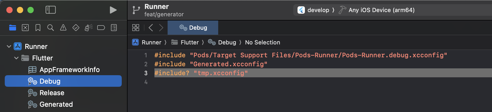
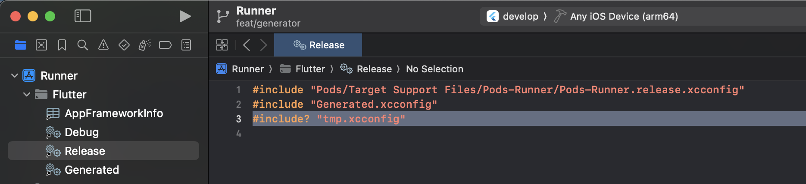
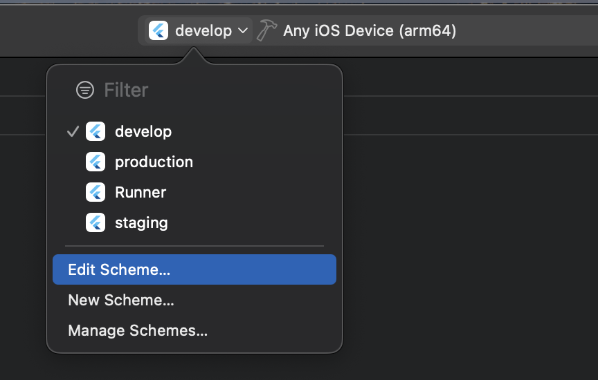
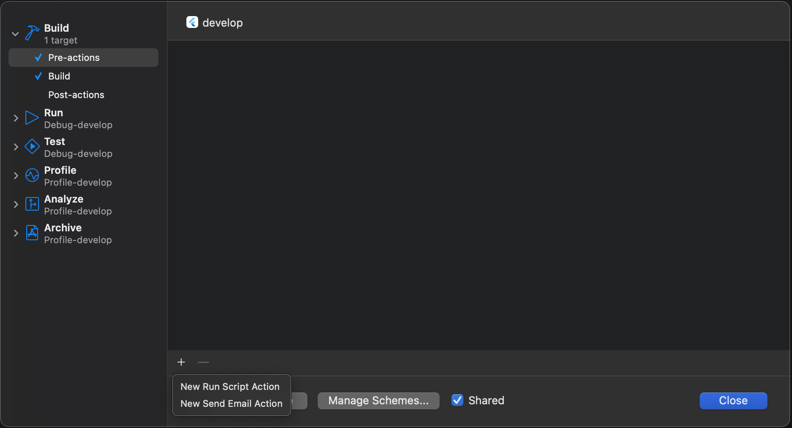
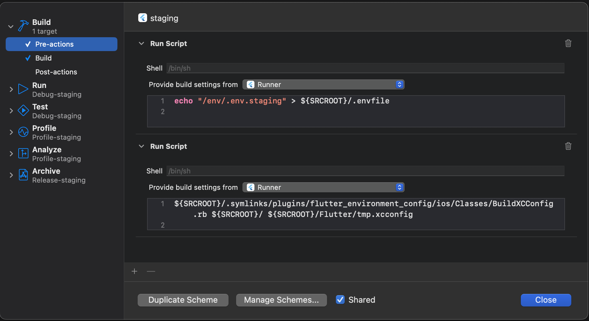
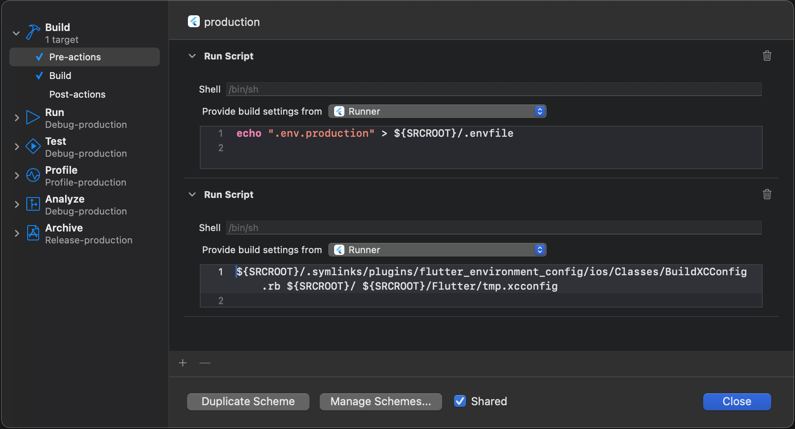

# iOS Setup Guide

A step-by-step guide to configure Flutter Environment Config for iOS projects.

## 📁 Create Environment Files

First, create environment files in your project root:

```text
my_app/
├── .env.develop         # Development environment
├── .env.staging         # Staging environment
├── .env.production      # Production environment
├── pubspec.yaml
└── ios/
    └── Runner/
        └── Info.plist
```

**Example `.env.develop`:**

```bash
APP_NAME=[DEV] My App
BUNDLE_ID=com.dev.myapp
VERSION_CODE=1
VERSION_NAME=1.0.0-dev
API_URL=https://dev-api.myapp.com
API_KEY=dev-key-123
DEBUG_MODE=true
```

**Example `.env.staging`:**

```bash
APP_NAME=[STAGING] My App
BUNDLE_ID=com.staging.myapp
VERSION_CODE=1
VERSION_NAME=1.0.0-staging
API_URL=https://staging-api.myapp.com
API_KEY=staging-key-456
DEBUG_MODE=false
```

**Example `.env.production`:**

```bash
APP_NAME=My App
BUNDLE_ID=com.myapp
VERSION_CODE=1
VERSION_NAME=1.0.0
API_URL=https://api.myapp.com
API_KEY=prod-key-789
DEBUG_MODE=false
```

## 🚀 Quick Setup

### Basic Setup (Code Access Only)

No additional setup is required if you only need to read environment variables from Swift/Objective-C code.

### Advanced Setup (Build Settings & Info.plist)

Follow these steps if you need environment variables in `Info.plist` or build settings:

#### 3. Configure XCConfig Files

Under `Runner/Flutter`, add to both `Debug.xcconfig` and `Release.xcconfig`:

```objective-c
#include? "tmp.xcconfig"
```




Add to `.gitignore`:

```text
**/ios/Flutter/tmp.xcconfig
```

#### 4. Setup Build Pre-Actions

In Xcode menu: **Product > Scheme > Edit Scheme**



Go to **Build > Pre-actions** and add **New Run Script Action**:



**First Script:**

```bash
echo "/env/.env" > ${SRCROOT}/.envfile
```

**Second Script:**

```bash
${SRCROOT}/.symlinks/plugins/flutter_environment_config/ios/Classes/BuildXCConfig.rb ${SRCROOT}/ ${SRCROOT}/Flutter/tmp.xcconfig
```

**Example configurations for different environments:**

**Development Scheme:**


**Staging Scheme:**


**Production Scheme:**


## 💻 Usage

### Info.plist Configuration

Update `ios/Runner/Info.plist`:

```xml
<dict>
    <key>CFBundleDisplayName</key>
    <string>$(APP_NAME)</string>

    <key>CFBundleIdentifier</key>
    <string>$(BUNDLE_ID)</string>

    <key>CFBundleVersion</key>
    <string>$(VERSION_CODE)</string>

    <key>CFBundleShortVersionString</key>
    <string>$(VERSION_NAME)</string>

    <!-- Custom configuration -->
    <key>API_URL</key>
    <string>$(API_URL)</string>
</dict>
```

### Swift

```swift
import flutter_environment_config

class ApiService {
    private let apiUrl = FlutterEnvironmentConfigPlugin.env(for: "API_URL") ?? ""
    private let apiKey = FlutterEnvironmentConfigPlugin.env(for: "API_KEY") ?? ""
    private let debugMode = FlutterEnvironmentConfigPlugin.env(for: "DEBUG_MODE") == "true"

    func createURLSession() -> URLSession {
        let config = URLSessionConfiguration.default
        config.httpAdditionalHeaders = [
            "Authorization": "Bearer \(apiKey)"
        ]
        return URLSession(configuration: config)
    }
}
```

### Objective-C

```objective-c
#import "FlutterEnvironmentConfigPlugin.h"

@interface ApiService : NSObject
@end

@implementation ApiService

- (void)makeApiCall {
    // Read individual keys
    NSString *apiUrl = [FlutterEnvironmentConfigPlugin envFor:@"API_URL"];
    NSString *apiKey = [FlutterEnvironmentConfigPlugin envFor:@"API_KEY"];

    // Or fetch the whole config
    NSDictionary *config = [FlutterEnvironmentConfigPlugin env];

    // Use in network requests
    NSURL *url = [NSURL URLWithString:[apiUrl stringByAppendingString:@"/api/data"]];
    NSMutableURLRequest *request = [NSMutableURLRequest requestWithURL:url];
    [request setValue:[NSString stringWithFormat:@"Bearer %@", apiKey]
   forHTTPHeaderField:@"Authorization"];
}

@end
```

### Build Commands

```bash
# Run with specific scheme
flutter run --flavor develop

# Run with staging scheme
flutter run --flavor staging

# Run with production scheme
flutter run --flavor production

# Build with specific scheme
flutter build ios --flavor develop
flutter build ios --flavor staging
flutter build ios --flavor production --release
```

## 📋 Best Practices

### 1. Environment Variable Naming

Use consistent naming conventions:

```bash
# App Information
APP_NAME=My App
APP_ID=com.company.myapp
VERSION_NAME=1.0.0
VERSION_CODE=1

# API Configuration
API_URL=https://api.example.com
API_TIMEOUT=30000

# Feature Flags
ENABLE_ANALYTICS=true
ENABLE_CRASH_REPORTING=false
DEBUG_MODE=true

# Third-party Keys (be careful with sensitive data)
GOOGLE_MAPS_API_KEY=your_key_here
FIREBASE_PROJECT_ID=your_project_id
```

### 2. Git Configuration

Add to your `.gitignore`:

```gitignore
# Environment files
.env.develop
.env.staging
.env.production
.env.local

# Generated files
**/ios/Flutter/tmp.xcconfig
```

Create example files for team members:

```text
.env.develop.example
.env.staging.example
.env.production.example
```

### 3. Build Configuration

Configure dynamic app information in **Build Settings**:

- **Product Bundle Identifier**: `$(APP_ID)`
- **Product Name**: `$(APP_NAME)`

In **User-Defined** section, set:

- `APP_ID`: `$(APP_ID)`
- `APP_NAME`: `$(APP_NAME)`
- `FLUTTER_BUILD_NAME`: `$(VERSION_NAME)`
- `FLUTTER_BUILD_NUMBER`: `$(VERSION_CODE)`

## ⚠️ Security

**Environment variables are embedded in your app bundle and can be extracted.**

### Never store

- API secrets and private keys
- Database credentials
- Signing certificates

### Safe to store

- API endpoints and URLs
- Feature flags
- Debug settings

## 🆘 Troubleshooting

### Common Issues

1. **Environment variables not loading**

   - Ensure `await FlutterEnvironmentConfig.loadEnvVariables()` is called before `runApp()`
   - Check that environment files exist in the project root
   - Verify file naming matches exactly (case-sensitive)

2. **Variables not available in Info.plist**

   - Check XCConfig includes are added to both Debug.xcconfig and Release.xcconfig
   - Verify pre-action scripts are configured correctly
   - Ensure `Runner` is selected in build settings

3. **iOS build issues**

   - Ensure `tmp.xcconfig` is in `.gitignore`
   - Verify Xcode schemes are properly configured
   - Check that Ruby script has execute permissions

4. **Variables returning null**
   - Check spelling of variable names (case-sensitive)
   - Ensure variables are defined in the correct environment file
   - Verify the correct environment file is being loaded

### Debug Tips

Add debugging to see which environment file is loaded:

```dart
void main() async {
  WidgetsFlutterBinding.ensureInitialized();
  await FlutterEnvironmentConfig.loadEnvVariables();

  // Debug: Print all loaded variables
  print('Loaded environment variables:');
  FlutterEnvironmentConfig.variables.forEach((key, value) {
    print('$key: $value');
  });

  runApp(const MyApp());
}
```

**Variables not updating:**

- Run `flutter clean && flutter pub get`
- Clean Xcode build folder (Cmd+Shift+K)
- Verify scheme names match Flutter flavors

For help, check the [example implementation](../example/) or open an issue.
